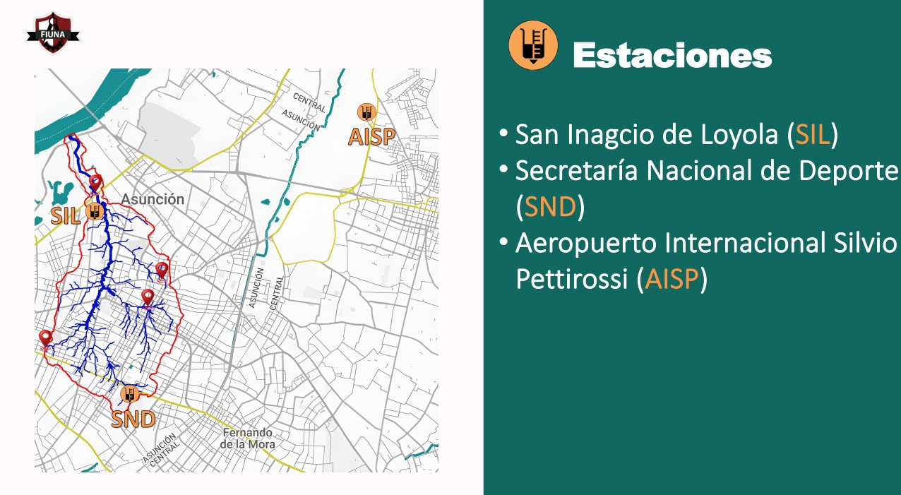
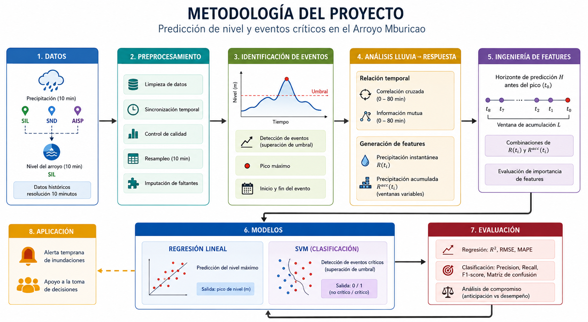
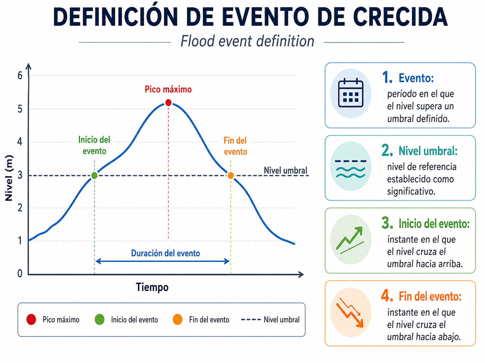
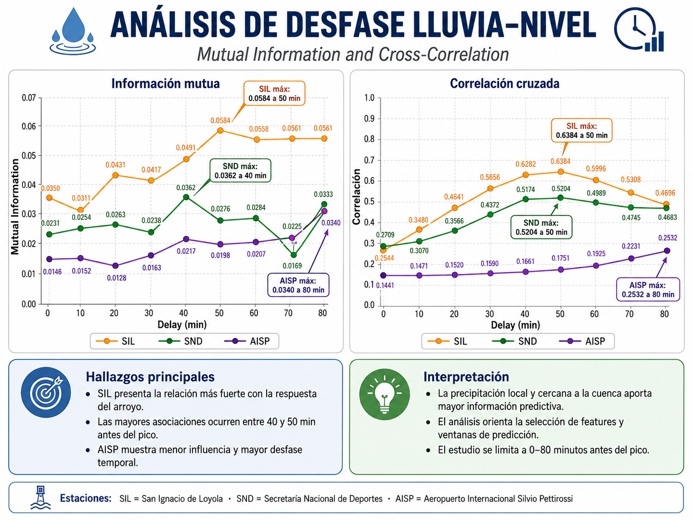
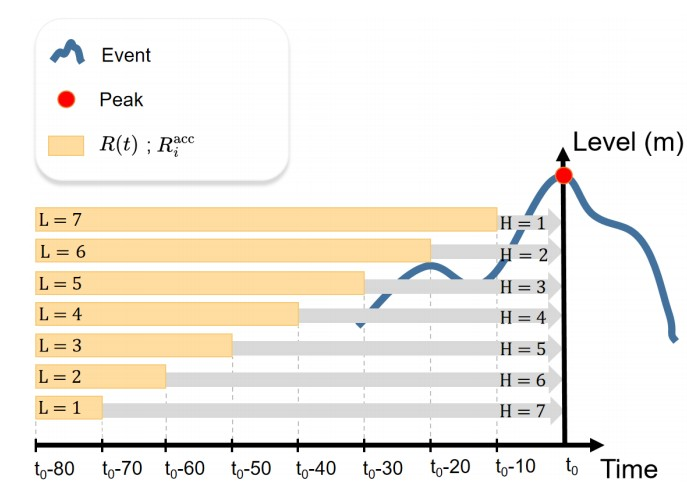
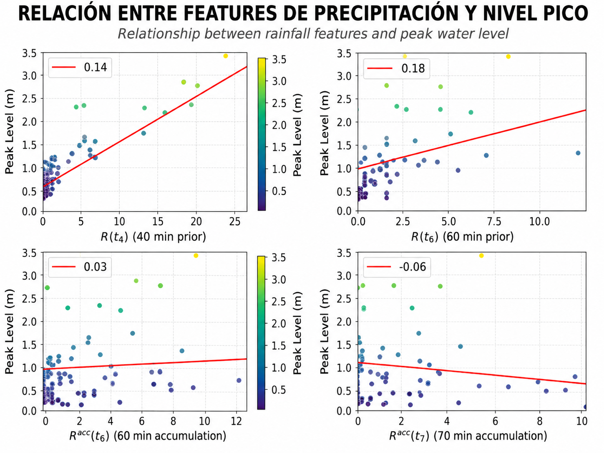

# Predicción de nivel y eventos críticos en el Arroyo Mburicao


<p align="center">
  <b>Modelos de Machine Learning para la predicción de niveles máximos y detección de eventos críticos en el Arroyo Mburicao, Asunción, Paraguay.</b>
</p>

<p align="center">
  🌧️ Precipitación &nbsp; • &nbsp;
  🌊 Nivel del arroyo &nbsp; • &nbsp;
  🤖 Machine Learning &nbsp; • &nbsp;
  ⚠️ Alerta temprana
</p>

---

## 📌 Sobre el proyecto

El **Arroyo Mburicao** atraviesa una zona altamente urbanizada del área metropolitana de Asunción y presenta aumentos rápidos de nivel durante eventos de precipitación intensa.

Este proyecto estudia la relación temporal entre la **precipitación** y el **nivel del arroyo** con el objetivo de desarrollar modelos de Machine Learning que puedan servir como base para futuros sistemas de **alerta temprana de inundaciones urbanas**.

El trabajo aborda dos problemas principales:

1. **Predicción del nivel máximo** que alcanzará el arroyo durante un evento.
2. **Clasificación de eventos críticos**, determinando si el nivel superará un umbral previamente establecido.

Para ello se utilizan datos históricos de precipitación y nivel registrados con una resolución temporal de **10 minutos**.

---

## 🎯 Objetivo

Desarrollar un enfoque basado en datos que permita utilizar información reciente de precipitación para anticipar la respuesta del Arroyo Mburicao.

El proyecto busca responder dos preguntas:

> **¿Qué nivel máximo alcanzará el arroyo?**

y

> **¿El evento superará un nivel crítico y debería generar una alerta?**

---

## 🗺️ Área de estudio

<p align="center">
  
</p>

El estudio se desarrolla en la cuenca urbana del **Arroyo Mburicao**, en el área metropolitana de Asunción, Paraguay.

La cuenca cuenta con diferentes puntos históricamente afectados por eventos de inundación y recibe información de tres estaciones meteorológicas:

| Estación | Ubicación                                  | Variables                        |
| -------- | ------------------------------------------ | -------------------------------- |
| **SIL**  | San Ignacio de Loyola                      | Precipitación + Nivel del arroyo |
| **SND**  | Secretaría Nacional de Deportes            | Precipitación                    |
| **AISP** | Aeropuerto Internacional Silvio Pettirossi | Precipitación                    |

Los registros poseen una resolución temporal de **10 minutos**.

Para el análisis fueron utilizados dos conjuntos temporales:

* **Set 1:** julio–agosto de 2021, incluyendo las tres estaciones.
* **Set 2:** julio de 2021–mayo de 2022, utilizando precipitación y nivel registrados en SIL.

El conjunto principal contiene **56 eventos asociados a incrementos del nivel del arroyo**.

---

# ⚙️ Metodología

<p align="center">
  
</p>

El flujo general del proyecto es:

```text
Datos de precipitación y nivel
              │
              ▼
      Preprocesamiento
              │
              ▼
    Sincronización temporal
              │
              ▼
    Identificación de eventos
              │
              ▼
Análisis lluvia → respuesta del arroyo
              │
      ┌───────┴────────┐
      ▼                ▼
Información       Correlación
   Mutua            Cruzada
      └───────┬────────┘
              ▼
    Ingeniería de Features
              │
        ┌─────┴─────┐
        ▼           ▼
   Regresión       SVM
        │           │
        ▼           ▼
 Pico de nivel   Evento crítico
```

---

## 1. Identificación de eventos

Los eventos fueron definidos a partir de incrementos significativos en la serie temporal del nivel del arroyo.

Para cada evento se identifica:

* Inicio del incremento del nivel.
* Pico máximo.
* Precipitaciones anteriores al pico.
* Precipitación acumulada en distintas ventanas temporales.

<p align="center">
  
</p>

Esta representación permite transformar las series temporales continuas en eventos individuales que posteriormente pueden ser utilizados para entrenar los modelos.

---

## 2. Relación temporal lluvia–nivel

Uno de los principales problemas consiste en determinar **cuánto tiempo tarda la precipitación en reflejarse como un aumento del nivel del arroyo**.

Para estudiar esta relación se utilizaron dos herramientas.

### Correlación cruzada

La correlación cruzada permite analizar el desfase temporal entre la precipitación registrada y la respuesta posterior del arroyo.

Los resultados muestran que las relaciones más fuertes entre precipitación y nivel se encuentran aproximadamente entre **40 y 50 minutos antes del evento** para las estaciones ubicadas dentro o próximas a la cuenca.

### Información mutua

La **Información Mutua (Mutual Information)** permite medir relaciones entre las variables de precipitación y el nivel máximo sin limitar el análisis únicamente a relaciones lineales.

Ambos análisis fueron utilizados para orientar la creación y selección de variables predictoras.

<p align="center">
  
</p>

El análisis temporal se limitó a un máximo de **80 minutos antes del pico**, evitando incorporar observaciones demasiado alejadas con menor información predictiva.

---

# 🧩 Ingeniería de características

A partir de los registros de precipitación se generan dos tipos principales de variables.

### Precipitación instantánea

Representada como:

[
R(t_i)
]

corresponde a la precipitación registrada en un instante específico previo al pico del evento.

Por ejemplo:

* (R(t_1)): precipitación cercana al pico.
* (R(t_4)): precipitación registrada anteriormente.
* (R(t_8)): precipitación más alejada temporalmente.

---

### Precipitación acumulada

También se calculan acumulaciones de precipitación sobre diferentes ventanas temporales:

[
R_i^{acc}=\sum_{t=t_8}^{t_i}R(t)
]

Estas variables permiten representar no solamente la intensidad instantánea de la lluvia, sino también la **cantidad de precipitación acumulada durante un intervalo previo al evento**.

---

## Ventanas temporales

<p align="center">
  
</p>

Se experimentó con diferentes horizontes de predicción y longitudes de acumulación.

De esta manera es posible estudiar el compromiso entre:

```text
Mayor anticipación
       ↕
Mayor capacidad predictiva
```

Las ventanas cercanas al pico contienen información más directamente relacionada con el aumento del nivel, mientras que horizontes más largos permiten anticipar el evento con mayor tiempo, aunque generalmente con menor desempeño.

---

# 📈 Predicción del nivel máximo

Para estimar el **pico máximo del nivel del arroyo** se implementó un modelo de **Regresión Lineal Múltiple**.

El modelo utiliza combinaciones de:

* Precipitación instantánea.
* Precipitación acumulada.
* Diferentes horizontes temporales.

Su formulación general puede representarse como:

[
\hat{y} =
\beta_0 +
\sum \beta_j R(t_j) +
\sum \alpha_k R_k^{acc}(t_k)
]

donde:

* (\hat{y}) es el nivel máximo estimado.
* (R(t_j)) representa precipitación instantánea.
* (R_k^{acc}) representa precipitación acumulada.
* (\beta) y (\alpha) son los coeficientes estimados por el modelo.

---

## Selección de variables

Para cada horizonte temporal se analizaron diferentes combinaciones de características.

La capacidad de generalización fue evaluada utilizando **5-fold cross-validation** y las métricas:

* **R² — Coefficient of Determination**
* **RMSE — Root Mean Squared Error**
* **MAPE — Mean Absolute Percentage Error**

---

## Relación de las características seleccionadas

<p align="center">
  
</p>

La figura anterior permite visualizar individualmente la relación entre algunas de las variables seleccionadas y el nivel máximo observado.

Entre ellas se encuentran:

* (R(t_4))
* (R(t_6))
* (R^{acc}(t_6))
* (R^{acc}(t_7))

El análisis muestra que algunas características presentan relaciones claramente más fuertes con el nivel máximo que otras.

Estas regresiones individuales son utilizadas principalmente para **interpretar las variables seleccionadas**, mientras que la predicción final utiliza múltiples características simultáneamente.

---

# 📊 Resultados de regresión

Los mejores resultados fueron obtenidos utilizando información relativamente cercana al pico del evento.

| Horizonte  |         R² |         RMSE |        MAPE |
| ---------- | ---------: | -----------: | ----------: |
| 10 min     |     0.8412 |     0.3304 m |     27.61 % |
| 20 min     |     0.8443 |     0.3272 m |     28.07 % |
| **30 min** | **0.8470** | **0.3243 m** | **28.19 %** |
| 40 min     |     0.8209 |     0.3509 m |     31.27 % |
| 50 min     |     0.6139 |     0.5152 m |     36.72 % |
| 60 min     |     0.0478 |     0.8090 m |     73.72 % |
| 70 min     |     0.0194 |     0.8210 m |     76.39 % |

### Resultado destacado

```text
R²   = 0.847
RMSE ≈ 0.32 m
MAPE ≈ 28 %
```

Los resultados indican que las observaciones de precipitación más próximas al pico proporcionan una señal predictiva más fuerte.

Una configuración de **40 minutos de anticipación** todavía alcanza:

```text
R²   = 0.8209
RMSE = 0.3509 m
MAPE = 31.27 %
```

mostrando la posibilidad de obtener estimaciones útiles con cierto tiempo de anticipación.

---

# ⚠️ Clasificación de eventos críticos

Además de estimar el nivel máximo, el proyecto aborda el problema como una tarea de **clasificación binaria**.

Para un nivel crítico (h_{crit}):

[
y =
\begin{cases}
1, & h_{peak} \geq h_{crit}\
0, & h_{peak} < h_{crit}
\end{cases}
]

donde:

```text
1 → Evento crítico / Alerta
0 → Evento no crítico / Sin alerta
```

Se analizaron diferentes niveles críticos:

[
h_{crit} \in {0.5,\ 1.0,\ 1.5,\ 2.0};m
]

El análisis principal se concentra en un umbral de:

[
h_{crit}=1.0,m
]

---

## Support Vector Machine

Para la clasificación se utiliza un modelo **Support Vector Machine (SVM)** con:

* Kernel RBF.
* Pesos de clase balanceados.
* Selección de características.
* Validación cruzada.
* Ajuste de hiperparámetros.

La evaluación considera principalmente:

* Precision
* Recall
* F1-score
* False Negatives

---

## ¿Por qué priorizar Recall?

En un sistema convencional de clasificación interesa mantener un equilibrio entre precision y recall.

Sin embargo, en un **sistema de alerta temprana**, un falso negativo representa un evento crítico que no fue detectado.

Por esta razón se presta especial atención al:

> **Recall — proporción de eventos críticos que fueron correctamente detectados.**

---

# 🚨 Resultados de clasificación

Para eventos con:

[
h_{crit}=1.0,m
]

la configuración seleccionada obtuvo aproximadamente:

| Métrica              |   Resultado |
| -------------------- | ----------: |
| **Recall**           | **84.62 %** |
| Precision            |     53.66 % |
| F1-score             |     65.67 % |
| Verdaderos positivos |          22 |
| Falsos negativos     |           4 |
| Falsos positivos     |          19 |
| Verdaderos negativos |          13 |

En otras palabras:

> **22 de 26 eventos críticos fueron correctamente identificados.**

El modelo mantiene una alta capacidad para detectar situaciones potencialmente peligrosas, aunque produce una cantidad considerable de falsas alarmas.

Este comportamiento representa el compromiso existente entre:

```text
Evitar perder un evento crítico
              ↕
Reducir falsas alarmas
```

En aplicaciones de alerta temprana, minimizar eventos críticos no detectados puede ser más importante que evitar completamente las falsas alarmas.

---

## Visualización de eventos detectados

<p align="center">
  
</p>

La visualización permite distinguir:

* 🟢 **True Positives:** eventos críticos detectados correctamente.
* 🟡 **False Negatives:** eventos críticos no detectados.
* 🔴 **False Positives:** falsas alarmas.

Los eventos cercanos al límite crítico representan algunos de los casos más difíciles de clasificar.

---

# 🏆 Principales resultados

El proyecto demuestra que es posible extraer información predictiva útil a partir de datos históricos de precipitación y nivel incluso trabajando con un conjunto de datos relativamente limitado.

### Regresión

```text
Best R²      ≈ 0.85
Best RMSE    ≈ 0.32 m
Best MAPE    ≈ 28 %
```

### Clasificación

```text
Critical threshold = 1.0 m
Recall             ≈ 85 %
Detected events    = 22 / 26
False negatives    = 4
```

Estos resultados muestran el potencial de utilizar modelos de Machine Learning de bajo costo computacional como parte de futuros sistemas de monitoreo y alerta temprana.

---

# 🗂️ Estructura del repositorio

```text
.
├── 00_Index/
│
├── data/
│   ├── raw/
│   ├── interim/
│   ├── processed/
│   └── external/
│
├── docs/
│   ├── merged/
│   ├── mburicao/
│   ├── model/
│   ├── station/
│   ├── visualizacion/
│   └── images/
│
├── notebooks/
│   ├── nivel/
│   ├── sil/
│   ├── snd/
│   ├── aisp/
│   ├── merged/
│   ├── features/
│   ├── csv_to_excel/
│   └── Map Heat/
│
├── publicaciones/
│   ├── CLEI2025/
│   └── poster2024/
│
├── src/
│   ├── models/
│   ├── evaluation/
│   └── utils/
│
└── README.md
```

### `data/`

Datos utilizados durante las diferentes etapas del proyecto.

* `raw/`: datos originales.
* `interim/`: información intermedia.
* `processed/`: datasets procesados.
* `external/`: fuentes externas.

### `notebooks/`

Notebooks utilizados durante el análisis exploratorio, procesamiento y experimentación.

Incluyen análisis individuales de:

* Nivel.
* SIL.
* SND.
* AISP.
* Integración de datasets.
* Ingeniería de características.
* Visualización.

### `src/`

Código reutilizable del proyecto.

* `models/`: entrenamiento y definición de modelos.
* `evaluation/`: métricas y evaluación.
* `utils/`: funciones auxiliares.

### `docs/`

Documentación, figuras y recursos gráficos asociados al proyecto.

### `publicaciones/`

Artículos, pósteres y otros materiales científicos derivados de la investigación.

---

# 🛠️ Tecnologías

El proyecto fue desarrollado principalmente utilizando:

* **Python**
* **Pandas**
* **NumPy**
* **Scikit-learn**
* **Matplotlib**
* **Jupyter Notebook**

Los principales métodos utilizados incluyen:

```text
Time Series Processing
        +
Cross-Correlation
        +
Mutual Information
        +
Feature Engineering
        +
Linear Regression
        +
Support Vector Machines
```

---

# 🔭 Trabajo futuro

Los resultados obtenidos representan una base para continuar desarrollando un sistema de alerta temprana más robusto.

Entre las principales líneas de trabajo se encuentran:

* Incorporar series temporales más extensas.
* Reducir la cantidad de falsas alarmas.
* Incorporar nuevas variables hidrológicas.
* Evaluar clasificadores híbridos o ensemble.
* Combinar modelos basados en datos con modelos hidrológicos.
* Integrar los modelos con infraestructura de monitoreo en tiempo real.
* Incorporar nuevas estaciones de medición dentro de la cuenca.

La disponibilidad de sensores de nivel y precipitación operativos permitiría avanzar desde un análisis histórico hacia una plataforma de **predicción y monitoreo en tiempo real**.

---

# 🌎 Visión del proyecto

El objetivo a largo plazo es avanzar hacia una arquitectura de este tipo:

```text
        CUENCA DEL MBURICAO
                │
       ┌────────┴────────┐
       │                 │
🌧️ Precipitación    🌊 Nivel
       │                 │
       └────────┬────────┘
                │
                ▼
        Adquisición de datos
                │
                ▼
         Plataforma central
                │
                ▼
       Modelo predictivo
          ┌─────┴─────┐
          ▼           ▼
     Pico futuro   Riesgo crítico
          │           │
          └─────┬─────┘
                ▼
           ⚠️ ALERTA
```

La combinación de estaciones de monitoreo, comunicaciones y modelos predictivos permitiría desarrollar herramientas de apoyo para comunidades e instituciones responsables de la gestión del riesgo urbano.

---

# 📄 Publicación

Parte de los resultados de este proyecto fueron documentados en el trabajo:

**Machine Learning Models for Water Level Prediction in Rapid Urban Streams: Case of Mburicao, Asunción, Paraguay**

Autores:

* Mathias Aguilar
* Hector Velázquez
* Diego H. Stalder
* Andrés Wehrle
* Jazmín Ojeda
* Leonardo B. L. Santos

El trabajo presenta la metodología de selección de características, los modelos de regresión y clasificación y los resultados obtenidos para el Arroyo Mburicao.

> Agregar aquí el enlace DOI, proceedings o URL oficial de la publicación una vez disponible.

---

# 👥 Autores y colaboradores

Proyecto desarrollado con participación de investigadores de:

**Facultad de Ingeniería — Universidad Nacional de Asunción (FIUNA)**
San Lorenzo, Paraguay

y colaboración del:

**National Center for Monitoring and Early Warning of Natural Disasters (Cemaden)**
São José dos Campos, Brasil.

---

# 📚 Citar este trabajo

Si utiliza este proyecto o sus resultados en trabajos académicos, considere citar la publicación asociada.

```bibtex
@inproceedings{mburicao_ml,
  title   = {Machine Learning Models for Water Level Prediction
             in Rapid Urban Streams: Case of Mburicao,
             Asuncion, Paraguay},
  author  = {Aguilar, Mathias and
             Velazquez, Hector and
             Stalder, Diego H. and
             Wehrle, Andres and
             Ojeda, Jazmin and
             Santos, Leonardo B. L.},
  year    = {2025}
}
```

> Completar los datos bibliográficos finales de la publicación antes de utilizar esta entrada como referencia definitiva.

---

# 📜 Licencia

Agregar aquí la licencia correspondiente al proyecto.

---

<p align="center">
  <b>Machine Learning applied to Urban Flood Early Warning 🌧️ → 🌊 → 🤖 → ⚠️</b>
</p>
